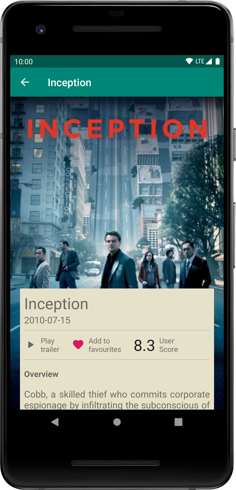
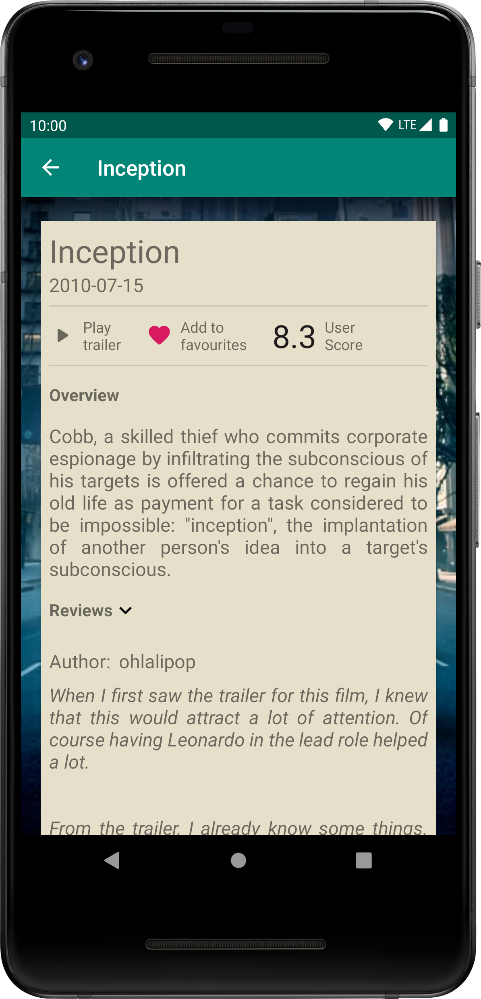

# Popular_movies

App project for Udacity Android Developer Nanodegree course  
To run the app add your API keys in the Constants.java file.

* Fetch data using the  <a href="https://www.themoviedb.org" target="_blank">TMDB API</a>
* Infinite scrolling with Paging Library
* Room database for the offline mode
 
 
|
